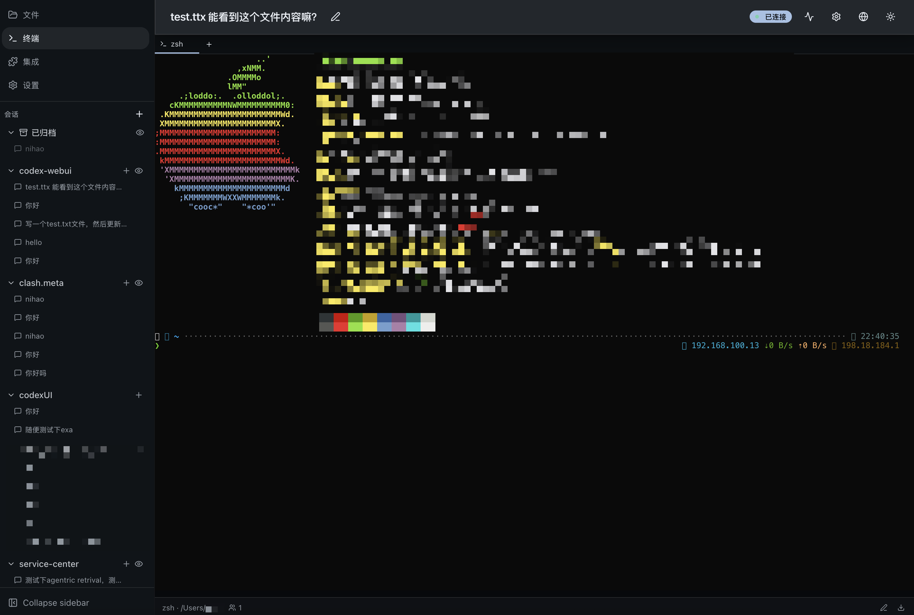

# Codex WebUI

给 [OpenAI Codex CLI](https://github.com/openai/codex) 做的 Web 前端。把命令行交互搬到浏览器里，支持多线程并发、文件管理、终端、插件市场等。

后端用 NestJS 通过 stdio JSON-RPC 和 `codex app-server` 通信，前端 React + Vite，中间用 Socket.IO 实时推送。

[English](./README.en.md)


## 功能

**对话与线程**
- 多线程并发运行，互不干扰
- 线程按工作区分组，支持归档、fork、回滚、重命名
- Markdown 渲染 + Shiki 代码高亮
- `@` 引用文件、粘贴图片
- 追问（steer）和中断（stop）正在执行的 turn

**审批流程**
- 命令执行、文件变更的审批卡片，直接在页面上操作
- 支持安全策略切换（sandbox 级别）
- 多设备同时在线时的 CAS 防冲突

**文件管理**


- 树形文件浏览器，支持拖拽移动
- Monaco Editor 代码查看
- Git diff 分栏对比（@git-diff-view）
- 上传 / 下载 / 重命名 / 复制 / 移动 / 新建目录

**终端**



- 多 tab 共享终端（node-pty + xterm.js）
- 断线重连，输出不丢失
- headless VT 回放

**集成与插件**


**其他**
- JWT + API Key 认证
- 插件/MCP 服务器管理
- 深色/浅色主题，中英文切换
- 响应式布局，手机平板也能用
- Docker 一键部署

## 技术栈

```
浏览器
  React 19 · Vite 8 · TanStack (Router + Query + Virtual)
  Zustand · Socket.IO Client · Monaco Editor · xterm.js
  Tailwind CSS 4 · shadcn/ui · Framer Motion · dnd-kit
     ↕  REST + WebSocket
后端
  NestJS 11 · Fastify 5 · Socket.IO · node-pty
  SQLite (better-sqlite3 + Drizzle ORM) · Pino
     ↕  stdio JSON-RPC
  codex app-server（子进程）
```

## 快速开始

### 前置条件

- Node.js >= 20
- pnpm >= 9
- [Codex CLI](https://github.com/openai/codex) 已安装并可用

### 本地开发

```bash
# 克隆项目
git clone https://github.com/your-username/codex-webui.git
cd codex-webui

# 安装依赖
pnpm install

# 配置环境变量
cp .env.example .env
# 编辑 .env，至少设置 WEBUI_API_KEY

# 启动后端（默认端口 8172）
pnpm start:dev

# 另一个终端，启动前端（端口 5173，自动代理到后端）
cd web && pnpm dev
```

打开 `http://localhost:5173` 即可使用。

### Docker 部署

```bash
# 设置环境变量
echo "WEBUI_API_KEY=your-secret-key" > .env
echo "OPENAI_API_KEY=sk-xxx" >> .env

# 启动
docker compose up -d
```

服务运行在 `http://localhost:8172`。

## 环境变量

| 变量 | 必填 | 默认值 | 说明 |
|------|:----:|--------|------|
| `WEBUI_API_KEY` | 是 | — | 登录密钥，同时用于派生 JWT 签名 |
| `PORT` | 否 | `8172` | 后端监听端口 |
| `CODEX_BIN` | 否 | `codex` | codex CLI 可执行文件路径 |
| `CODEX_HOME` | 否 | `~/.codex` | Codex 主目录 |
| `WORKSPACE_ROOTS` | 否 | — | 逗号分隔的允许访问目录 |
| `LOG_LEVEL` | 否 | `info` / `debug` | Pino 日志级别 |
| `WEBUI_DB_PATH` | 否 | `CODEX_HOME/codex-webui.sqlite` | SQLite 数据库路径 |
| `WEBUI_UPLOAD_MAX_BYTES` | 否 | `104857600` | 上传文件大小限制（默认 100MB） |
| `DEFAULT_TERMINAL_CWD` | 否 | — | 终端默认工作目录，路径无效时启动报错 |
| `WEBUI_TERMINAL_MAX_SESSIONS` | 否 | `10` | 最大并发终端会话数（1-50） |
| `WEBUI_TERMINAL_GRACE_MS` | 否 | `45000` | 断开连接后终端保活时长（10s-300s） |
| `WEBUI_TERMINAL_SCROLLBACK` | 否 | `5000` | 终端回滚缓冲区行数（100-50000） |

## 项目结构

```
├── src/                  # NestJS 后端
│   ├── codex/            # 进程管理、JSON-RPC 客户端
│   ├── threads/          # 线程 CRUD、WebSocket 网关
│   ├── files/            # 文件操作、路径安全校验
│   ├── terminal/         # 多 tab 终端（node-pty）
│   ├── auth/             # JWT + API Key 认证
│   ├── database/         # SQLite + Drizzle ORM
│   └── ...               # 其他模块
├── web/                  # React 前端
│   └── src/
│       ├── routes/       # TanStack Router 页面
│       ├── components/   # UI 组件
│       ├── stores/       # Zustand 状态管理
│       ├── hooks/        # 自定义 hooks
│       └── generated/    # Hey API SDK（自动生成）
├── Dockerfile
└── docker-compose.yml
```

## 常用命令

```bash
pnpm start:dev          # 后端开发模式
pnpm build              # 编译后端
pnpm test               # 运行测试
pnpm lint               # ESLint 检查
pnpm db:generate        # 生成数据库迁移
pnpm db:migrate         # 执行迁移
cd web && pnpm dev      # 前端开发模式
cd web && pnpm build    # 前端构建（输出到 public/）
```
